[telegram](https://t.me/sabrval) &nbsp;·&nbsp;
[x](https://x.com/sabrvaliullov) &nbsp;·&nbsp;
[linkedin](https://www.linkedin.com/in/valiullov-sabyrzhan) &nbsp;·&nbsp;
[email](mailto:sabyrzanvaliullov@gmail.com)

> Big-data student, building LLM products in the open. 
> Ship the smallest thing that proves the idea, then keep only what survives.

Most of what I build sits at the same seam: a language model doing real work 
behind a product surface people actually touch — chess coaching, journaling, 
feedback triage, RAG hygiene. Telegram bots when the interface should be a 
conversation, Next.js when it should be a page, FastAPI and Postgres underneath.

<samp>typescript &nbsp; python &nbsp; next.js &nbsp; react &nbsp; fastapi &nbsp; postgres &nbsp; supabase &nbsp; openai &nbsp; java &nbsp; swift &nbsp; docker &nbsp; git</samp>

**[blunderlab](https://github.com/sabr2007/blunderlab)** &nbsp;·&nbsp; <samp>next.js, supabase, stockfish wasm</samp> 
AI chess coach that refuses to stop at "best move". It names why the blunder 
happened, the pattern underneath it, and what to drill next. 
[blunderlab.vercel.app](https://blunderlab.vercel.app)

**[staleness-monitor-v2](https://github.com/sabr2007/staleness-monitor-v2)** &nbsp;·&nbsp; <samp>typescript, next.js</samp> 
Knowledge bases rot quietly and RAG chatbots keep answering from them. This 
diffs documents against the live site, surfacing contradictions and 
time-stamped claims that have expired.

**[linetta](https://github.com/sabr2007/linetta)** &nbsp;·&nbsp; <samp>python, typescript</samp> 
Voice-first AI journaling. Speak, and the entry writes, tags and connects 
itself — landing, docs and backend core in one repo.

**[hearify](https://github.com/sabr2007/hearify)** &nbsp;·&nbsp; <samp>next.js, typescript</samp> 
Passive feedback intelligence: read what users need from the channels they 
already use, before anyone files a ticket. 
[hearify-weld.vercel.app](https://hearify-weld.vercel.app)

<samp>A few more live under NDA and aren't listed here.</samp>

Every graphic here is generated, not embedded from anyone else's server. 
`ascii.svg` is a photo pushed through a character ramp by 
[`scripts/make_portrait.py`](scripts/make_portrait.py); the stat graphics and 
these section headings are drawn by [a scheduled action](.github/workflows/stats.yml) 
straight from the GitHub GraphQL API, once a day, committing only what changed.

They animate with SMIL inside the SVG, because GitHub strips scripts from 
READMEs — and since nothing loads from a third party, nothing here can 
rate-limit or go dark. The headings are SVGs for the same reason: GitHub also 
strips CSS, so an image is the only way to put this page's own typeface on them.

The typeface is [JetBrains Mono](scripts/fonts), subset to just the characters 
each graphic draws and inlined as base64. That isn't only for looks: the 
portrait's grid assumes an advance width of exactly 0.600 em, and a viewer whose 
default monospace is narrower would otherwise see it squeezed.

Language totals cover public repositories only. `year.svg` uses the portrait's 
character ramp: `:` `+` `#` `@`, quiet to loud.
